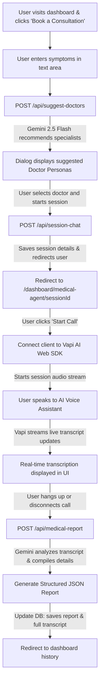

# AI Medical Voice Agent 🩺🎙️

AI Medical Voice Agent is a modern, real-time healthcare consulting web application. It enables users to describe their symptoms, automatically get matched with specialized AI doctor personas, conduct hands-free voice consultations using state-of-the-art text-to-speech and speech-to-text integration, and receive detailed structured medical reports summarizing the session.

---

## 🏗️ System Architecture & Workflow

Here is a visual representation of how data and user interactions flow through the application:



---

## 🩺 Step-by-Step Application Flow

### 1. User Onboarding & Dashboard Access
* **Authentication:** Handled securely by **Clerk**. Unauthenticated users are redirected to sign-in or sign-up flows.
* **Database Syncing:** Logged-in users are synced with the PostgreSQL database.
* **Main Dashboard:** Displays:
  * Option to **Book a Consultation** (new session).
  * A **History** list showing all previous medical voice sessions.
  * A static gallery of **AI Doctor Agents** representing different specialities.

### 2. Booking a Consultation & Symptom Description
* Clicking on "Book a Consultation" opens a multi-step dialog.
* **Step 1:** The user describes their current symptoms (e.g., *"My throat has been dry and sore for the past 3 days and I have a mild fever"*).
* **Step 2:** The app calls the `/api/suggest-doctors` endpoint, passing the symptoms.

### 3. AI-Driven Doctor Matchmaking (`/api/suggest-doctors`)
* The system passes the user's symptoms along with the full database of specialized doctor agents to the **Google Gemini API** (using `gemini-2.5-flash`).
* The LLM maps the symptoms to the most relevant medical specialties (e.g., matching a sore throat to an ENT Specialist or General Physician).
* The suggested doctor cards are displayed in the dialog for the user to choose.

### 4. Session Initialization (`/api/session-chat`)
* Upon selecting a doctor, the user triggers the consultation.
* A `POST /api/session-chat` request is sent to create a new session entry in the database.
* The session is assigned a unique `sessionId` (UUIDv4) and stores the symptom notes along with the selected doctor details.
* The user is immediately redirected to the active voice consultation room: `/dashboard/medical-agent/[sessionId]`.

### 5. Live Voice Consultation Session
* The page retrieves the session metadata from the database.
* When the user clicks **Start Call**:
  * The frontend initializes a **Vapi Web Client** session.
  * It starts the call using the Vapi Assistant ID from the configuration, passing **Assistant Overrides** containing the chosen doctor's system instructions and specialization restrictions.
  * The custom system prompt ensures the AI acts in character (e.g., as a Cardiologist) and **only** answers questions directly related to that field (rejecting unrelated questions like *"how many moons does Jupiter have"*).
  * Transcripts are streamed bi-directionally. The user hears speech output from ElevenLabs while their own voice is transcribed in real-time on screen.

### 6. Summary, Structured Report Generation & Hangup (`/api/medical-report`)
* When the user clicks **Disconnect**:
  * The final conversation transcript is compiled.
  * The frontend calls `POST /api/medical-report`, passing the transcript messages, doctor persona details, and `sessionId`.
  * The backend invokes Gemini to parse the conversation and generate a structured JSON medical report containing:
    * **chiefComplaint:** Core reason for the consultation.
    * **symptoms:** Array of symptoms discussed.
    * **duration:** Length of time symptoms have persisted.
    * **severity:** Mild, moderate, or severe.
    * **medicationsMentioned:** Any drugs brought up.
    * **recommendations:** Non-prescriptive guidelines.
    * **summary:** Short conversational recap.
  * The report and the chat transcript are updated in the database session entry.
  * The call is terminated, and the user is redirected back to the dashboard.

### 7. Historical Consultation Records
* The dashboard's **History** list updates with the new entry.
* Users can click on any previous session to review their structured medical report and read the full text transcript of the voice conversation.

---

## 🗄️ Database Schema Overview

The database is built on **PostgreSQL** (hosted via **Neon Database**) and managed via **Drizzle ORM**.

### 1. `users` Table
Stores basic profile details for authenticated patients.
* `id`: Integer (Primary Key, Identity)
* `name`: Varchar(255)
* `email`: Varchar(255) (Unique, used as identity identifier)
* `credits`: Integer (Default: 0)

### 2. `session_chat` Table
Stores details of each consultation, including the audio transcription and generated summaries.
* `id`: Integer (Primary Key, Identity)
* `sessionId`: Varchar(255) (Unique UUID)
* `note`: Text (User's initial symptom input)
* `selectedDoctor`: JSON (Metadata of the consulting doctor agent)
* `conversation`: JSON (Full message list history between user & AI agent)
* `report`: JSON (The structured medical report summary generated by Gemini)
* `createdBy`: Varchar(255) (Foreign Key referencing `users.email`)
* `createdOn`: Varchar(255) (Session creation timestamp)

---

## 🛠️ Technology Stack

* **Frontend Framework:** Next.js (React 19, Turbopack)
* **Styling:** Tailwind CSS & Shadcn/UI
* **Database & ORM:** PostgreSQL (Neon DB) & Drizzle ORM
* **Authentication:** Clerk
* **Voice Stream Engine:** Vapi Web SDK
* **Speech synthesis (TTS):** ElevenLabs (via Vapi integration)
* **LLM Models:** 
  * Google Gemini API (`gemini-2.5-flash`) for doctor suggestions and structured medical report summarization.
  * OpenAI (`gpt-4o-mini` via Vapi) for real-time voice intelligence.

---

## 🚀 Getting Started

### 1. Setup Environment Variables
Create a `.env` (or `.env.local`) file in the root directory:

```env
DATABASE_URL=your_postgresql_connection_string

NEXT_PUBLIC_CLERK_PUBLISHABLE_KEY=your_clerk_publishable_key
CLERK_SECRET_KEY=your_clerk_secret_key

NEXT_PUBLIC_VAPI_API_KEY=your_vapi_public_api_key
NEXT_PUBLIC_VAPI_VOICE_ASSISTANT_ID=your_vapi_assistant_id

GEMINI_API_KEY=your_google_gemini_api_key
```

### 2. Install Dependencies
```bash
npm install
```

### 3. Run Development Server
```bash
npm run dev
```
Open [http://localhost:3000](http://localhost:3000) with your browser to experience the AI Medical Voice Agent.
