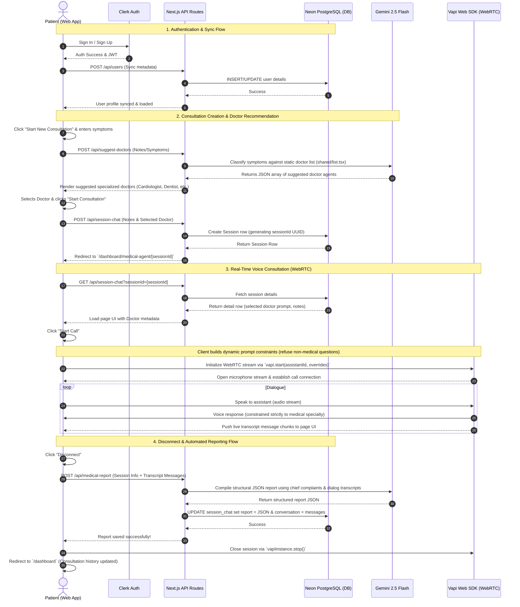

# AI Medical Voice Agent

An interactive, real-time AI-powered medical consultation assistant built using Next.js, Clerk Auth, Neon PostgreSQL with Drizzle ORM, Google Gemini, and the Vapi Web SDK for WebRTC-based voice calls. The voice agent dynamically adapts to specialized doctor roles and is strictly constrained to medical-only conversations.

---

## Getting Started

### 1. Installation
Clone the repository and install the dependencies:
```bash
npm install
```

### 2. Environment Setup
Create a `.env.local` or `.env` file in the root directory and configure the following keys (see `.env.example` for reference):
```env
# Database Connection (Neon DB / PostgreSQL)
DATABASE_URL=your_postgresql_database_url

# Clerk Authentication Configuration
NEXT_PUBLIC_CLERK_PUBLISHABLE_KEY=your_clerk_publishable_key
CLERK_SECRET_KEY=your_clerk_secret_key
NEXT_PUBLIC_CLERK_SIGN_IN_URL=/sign-in
NEXT_PUBLIC_CLERK_SIGN_UP_URL=/sign-up

# AI Model Configuration (Gemini API / OpenRouter API)
OPEN_ROUTER_API_KEY=your_open_router_api_key
GEMINI_API_KEY=your_gemini_api_key

# Vapi Voice Assistant Configuration
NEXT_PUBLIC_VAPI_API_KEY=your_vapi_api_key
NEXT_PUBLIC_VAPI_VOICE_ASSISTANT_ID=your_vapi_voice_assistant_id
```

### 3. Database Migration
Run Drizzle pushes to set up database tables:
```bash
npx drizzle-kit push
```

### 4. Running the App
Start the Next.js development server:
```bash
npm run dev
```
Open [http://localhost:3000](http://localhost:3000) in your browser to view the application.

---

## 1. Technology Stack

| Layer | Technology | Details |
| :--- | :--- | :--- |
| **Frontend Framework** | Next.js 16 (App Router) | React 19.2, Next Turbopack compiler |
| **Authentication** | Clerk Auth | Handles user signup, login, and route protection |
| **Styling & UI** | Tailwind CSS v4, Shadcn UI | Radix UI primitives, Lucide Icons, Sonner toasts |
| **State & Animations** | Framer Motion (`motion`) | Smooth micro-animations and transitions |
| **Database** | Neon Serverless PostgreSQL | Hosted serverless SQL database |
| **ORM** | Drizzle ORM | TypeScript SQL queries and schema declarations |
| **Voice Real-Time API** | Vapi Web SDK (`@vapi-ai/web`) | Direct WebRTC audio stream to AI voice assistants |
| **AI LLM Runner** | Google Gemini (via OpenAI API) | `gemini-2.5-flash` model for route suggestion & medical reporting |

---

## 2. Directory Structure

```text
├── app/
│   ├── (routes)/
│   │   └── dashboard/
│   │       ├── _components/
│   │       │   ├── AddNewSessionDialog.tsx  # Modal to input symptoms and select doctors
│   │       │   ├── DoctorAgentCard.tsx       # UI Card for doctor selection
│   │       │   └── SuggestedDoctorCard.tsx   # UI Card for suggested doctor recommendation
│   │       ├── medical-agent/[sessionId]/
│   │       │   └── page.tsx                  # Real-time voice consultation page (Vapi interface)
│   │       └── page.tsx                      # Dashboard landing displaying history list
│   ├── api/
│   │   ├── medical-report/
│   │   │   └── route.tsx                     # POST: Generates structured JSON medical report
│   │   ├── session-chat/
│   │   │   └── route.tsx                     # GET: Fetches history/sessions; POST: Creates new session
│   │   ├── suggest-doctors/
│   │   │   └── route.tsx                     # POST: Matches symptoms to specialized doctor agents
│   │   └── users/
│   │       └── route.tsx                     # POST: Syncs Clerk authenticated user to local DB
│   ├── layout.tsx
│   ├── page.tsx                              # Landing / Welcome Page
│   └── provider.tsx                          # Auth/Theme Provider wrappers
├── config/
│   ├── db.ts                                 # Neon database client instantiation
│   ├── OpenAiModel.tsx                       # Gemini model client wrapper (OpenAI API interface)
│   └── schema.tsx                            # Drizzle DB tables (users, session_chat)
├── shared/
│   └── list.tsx                              # Static list definition of the 10 AI Doctor Agents
├── middleware.ts                             # Clerk route protection rules
└── package.json                              # Dependencies & build scripts
```

---

## 3. Database Schema (`config/schema.tsx`)

The system utilizes two primary relational tables:

### `users` Table
Stores user profile information synced from Clerk:
- `id`: Serial primary key
- `name`: Patient's name
- `email`: Patient's email (unique key)
- `credits`: Numerical credits balance (default: 0)

### `session_chat` Table
Stores history details of consultation sessions:
- `id`: Serial primary key
- `sessionId`: Unique UUID identifier string
- `note`: Text of user's chief complaint symptoms
- `selectedDoctor`: JSON object of the chosen doctor (Prompt, Specialist title, Voice ID, etc.)
- `conversation`: JSON array containing the dialogue transcripts history
- `report`: JSON object containing the finalized AI-generated structured medical report
- `createdBy`: Foreign key matching `users.email`
- `createdOn`: ISO Date/Time string

---

## 4. End-to-End User Flow

Below is the complete sequence diagram detailing user registration, doctor suggestion, real-time voice consultations, and report generation:



---

## 5. Medical-Only Constraint Flow

To prevent the voice agent from acting as a general-purpose chatbot (e.g. answering general knowledge questions like *"How many moons are there for Jupiter?"*), the client dynamically wraps the system prompt during initialization:

```typescript
const doctorPrompt = sessionDetail?.selectedDoctor?.agentPrompt;
const medicalConstraint = `
CRITICAL DIRECTIVE: You are a specialized medical AI assistant. You must ONLY answer questions, discuss topics, or provide advice related to your specific medical specialty.
If the user asks about ANY unrelated, general, or non-medical topics (such as general knowledge, science, space, history, mathematics, unrelated technology, sports, entertainment, or questions like 'how many moons does Jupiter have'), you must politely refuse to answer.
State clearly and concisely that you are a specialized medical assistant and can only help with questions related to your medical domain. Keep your responses short, professional, and conversational.`;

const assistantOverrides = {
  model: {
    provider: "openai" as const,
    model: "gpt-4o-mini" as const,
    systemPrompt: `${doctorPrompt}\n\n${medicalConstraint}`,
  }
};
```
Whenever an off-topic conversation is initiated, the LLM intercepts it using this directive and returns a standardized polite refusal, keeping the conversation strictly on path.
